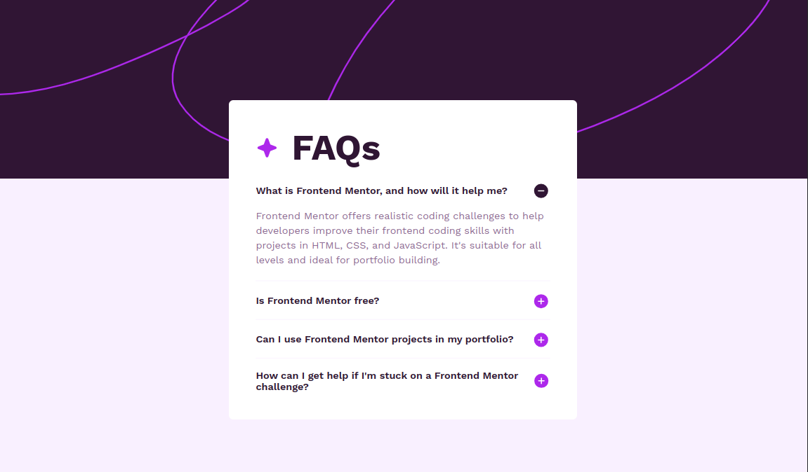

# Frontend Mentor - FAQ accordion solution

This is a solution to the [FAQ accordion challenge on Frontend Mentor](https://www.frontendmentor.io/challenges/faq-accordion-wyfFdeBwBz). Frontend Mentor challenges help you improve your coding skills by building realistic projects.

## Table of contents

- [Overview](#overview)
  - [The challenge](#the-challenge)
  - [Screenshot](#screenshot)
  - [Links](#links)
- [My process](#my-process)
  - [Built with](#built-with)
  - [What I learned](#what-i-learned)
  - [Continued development](#continued-development)
  - [Useful resources](#useful-resources)
- [Author](#author)

## Overview

### The challenge

Users should be able to:

- Hide/Show the answer to a question when the question is clicked
- Navigate the questions and hide/show answers using keyboard navigation alone
- View the optimal layout for the interface depending on their device's screen size
- See hover and focus states for all interactive elements on the page

### Screenshot

### Links

- Solution URL: [Add solution URL here](https://your-solution-url.com)
- Live Site URL: [FAQ Accordion Demo](https://timamero.github.io/frontend-mentor-faq-accordion/)

## My process

### Built with

- Semantic HTML5 markup
- CSS custom properties
- Flexbox
- CSS Grid
- Mobile-first workflow
- [React](https://reactjs.org/) - JS library
- [Vite](https://vitejs.dev/) - Build tool

### What I learned

I learned how to create a responsive and accessible accordion component.

### Continued development

Things that I would focus on in future development of this project are improving the re-usability of the Accordion component and adding tests.

### Useful resources

- [Accordion Pattern (Sections With Show/Hide Functionality)](https://www.w3.org/WAI/ARIA/apg/patterns/accordion/) - This helped me to improve the accessibility of the accordion component.

## Author

- Website - [Fatima Camero](https://www.fbcamero.com)
- Frontend Mentor - [@timamero](https://www.frontendmentor.io/profile/timamero)
